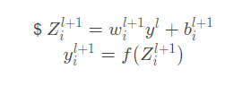

# 1. DropOut

        Dropout是2012年深度学习视觉领域的开山之作paper：AlexNet《ImageNet Classification with Deep Convolutional》所提到的算法，用于提高网络的泛化能力, 防止过拟合。Dropout现在一般用于全连接层，卷积层一般不使用Dropout，而是使用BN来防止过拟合，而且卷积核还会有relu等非线性函数，降低特征直接的关联性。

## 1.1、什么是DropOut?

        我们知道，典型的神经网络其训练流程是将输入通过网络进行正向传导，然后将loss进行反向传播。Dropout就是针对这一过程之中，随机地删除隐藏层的部分单元，进行上述过程。

具体步骤：

1. 对一批样本，随机删除网络中的一些隐藏神经元，保持输入输出神经元不变；
2. 将输入通过修改后的网络进行前向传播，然后将误差通过修改后的网络进行反向传播；
3. 对于另外一批的训练样本，重复上述操作1，2；

图解：  
  
如上图左边是正常工作的神经网络，右边是采用Dropout后的网络。

        正常神经网络公式表达：



        Dropout后的神经网络表达式：


注：

1. 其中Bernoulli函数，是为了以概率p（一般设为0.5或0.3），随机生成一个0、1的向量；
2. $r^{(l)}$是为了让某个神经元以p的概率失活（激活值$r^{(l)}$ 为0);

## 1.2、为什么DropOut有效？

论文原作者Hinton认为可能又以下两个原因：

1. 可以理解为模型平均，起到一种Vote的作用。对于全连接神经网络而言，我们用相同的数据去训练5个不同的神经网络可能会得到多个不同的结果，我们可以通过一种vote机制来决定多票者胜出，因此相对而言提升了网络的精度与鲁棒性。同理，对于单个神经网络而言，如果我们将其进行分批（某些神经元随机失活），虽然不同的网络可能会产生不同程度的过拟合，但是将其公用一个损失函数，相当于对其同时进行了优化，取了平均，因此可以较为有效地防止过拟合的发生。
2. 减少神经元之间复杂的共适应性（神经元之间协同性）。隐藏层神经元被随机删除之后，使得全连接网络具有了一定的稀疏化，从而有效地减轻了不同特征的协同效应。也就是说，有些特征可能会依赖于固定关系的隐含节点的共同作用，而通过Dropout的话，它强迫一个神经单元，和随机挑选出来的其他神经单元共同工作，达到好的效果。消除减弱了神经元节点间的联合适应性，增强了泛化能力。由于每次用输入网络的样本进行权值更新时，隐含节点都是以一定概率随机出现，因此不能保证每2个隐含节点每次都同时出现，这样权值的更新不再依赖于有固定关系隐含节点的共同作用，阻止了某些特征仅仅在其它特定特征下才有效果的情况。

## 1.3、代码实现

```python
import numpy as np

def dropout(x, level):
    # p表示失活的概率 为0的概率
    if level < 0 or level >= 1:  # p，必须在0~1之间
        raise Exception('Dropout p must be in interval [0, 1]')
    retain_prob = 1. - level
    # 我们通过binomial函数，生成与x（x表示输入数据，要对其dropout）一样的维数向量。
    # binomial函数就像抛硬币一样，我们可以把每个神经元当做抛硬币一样
    # 硬币正面的概率为p，n表示每个神经元试验的次数,因为我们每个神经元只需要抛一次就可以了所以n=1
    # 失活的概率是level, 最后生成0的个数不一定是： level x size个
    # size参数是我们有多少个硬币
    # p = retain_prob: 生成1的概率，正常工作的概率
    # 即将生成一个0、1分布的向量，0表示这个神经元被屏蔽，不工作了，也就是dropout了, 1表示正常工作
    sample = np.random.binomial(n=1, p=retain_prob, size=x.shape)
    print("0, 1向量：", sample)
    # 0、1与x相乘，我们就可以屏蔽某些神经元，让它们的值变为0。1则不影响
    x *= sample
    # 对余下的非0的进行扩大倍数,因为p<0。0/x=0,所以0不影响
    x /= retain_prob
    return x

if __name__ == '__main__':
    x = np.asarray([1, 2, 3, 4, 5, 6, 7, 8, 9, 10], dtype=np.float32)
    print("输入：", x)
    out = dropout(x, 0.5)
    print("输出：", out)
```

注：为什么对余下的神经元需要进行rescale： x /= retain_prob?

        rescale被称为inverted dropout。当模型使用了dropout layer，训练的时候只有占比为 1-p 的隐藏层单元参与训练，那么在预测的时候，如果所有的隐藏层单元都需要参与进来，则得到的结果相比训练时平均要大 1/1-p ，为了避免这种情况，就需要测试的时候将输出结果乘以 1/1-p 使下一层的输入规模保持不变。而利用inverted dropout，我们可以在训练的时候直接将dropout后留下的权重扩大 1/1-p 倍，这样就可以使结果的scale保持不变，而在预测的时候也不用做额外的操作了，更方便一些。

## 1.4、结果


## 1.5、缺点

1. DropOut减缓了收敛的速度；
2. DropOut对卷积层的效果不大；
3. DropOut与BN（也有正则化的作用）不怎么兼容，我们通常使用BN；

# 二、DropBlock(最重要)

YOLO v4使用了DropBlock，在卷积层的效果很好；

有效性：

1. 可以丢弃更多的语义信息
2. 训练出来的网络鲁棒性更强
3. 可以学到更多空间上的分布表示

> 论文：https://arxiv.org/pdf/1810.12890.pdf  
> 源码：[link](https://github.com/miguelvr/dropblock).

## 2.1、提出背景

        DropOut在全连接层可以起到一个很好的防止过拟合的作用，但是在卷积层却没有什么效果。这是因为在卷积层中feature的激活单元（神经元unit）是相互关联的（全连接层经过展平处理所以可能是没有关联的），所以即使在卷积层加上了DropOut，它的语义信息仍然可以从它相邻的unit中获取而传到下一层feature map。

        而几乎所有的正则化方法的原理都是通过增加噪声来防止过拟合。DropOut也是这样做的：通过随机删除语义信息。

> 我的理解是：一个人一直做简单题，简单题做的太多了，导致他一看到简单题就会做（训练集表现很好），但是一碰到没见过的难题（没见过的测试集），就不会了，所以我们在平时他做简单题的时候就随机的在简单题中穿插一些难题（丢失语义信息的feature map）。

        但是DropOut只是随机的删除feature map中的unit，这些丢失的unit(语义信息)通常是分散的，如下图b中，蓝色的是我们的语义信息，一个个unit是我们的激活单元，虽然我们随机的丢失了一些分散的语义信息（打X的部分），但是一个feature map中它的相邻的unit仍然包含着与其密切相关的语义信息，所以丢失的语义信息还是会通过它相邻的unit来学习并传给下一层的feature map。这样就起不到我们添加噪音的目的了。

> 我的理解：如下图b，尽管丢失了一些语义信息（假设是耳朵的一部分），但是它相邻的其他unit还是会将耳朵的其他语义信息传给下一个feature，关于耳朵的语义信息还是可以从相邻的unit中学习到，所以下一层的feature map还是可以得到耳朵的语义信息。

  
        为了解决这个问题，论文作者提出了一种新型的DropOut，一种具有结构化的DropOut。简单来说就是，在一个feature map中，删除连续的unit（Block失活），这样可以有效的删除语义信息（丢失的语义信息无法从它相邻的unit中获取，因为它相邻的unit也失活了）。迫使剩余的unit学习更多的语义信息，防止过拟合。如上图c,删除一个feature map 中的连续unit(Block)。

## 2.2、算法流程

  


1. 输入feature map A, block_size, $\gamma$, mode(运行模式)
2. 如果运行模式是推理模式，返回A
3. 一般的DropOut: $\gamma$按伯努利分布生成mask M(0, 1矩阵),如图a(以$\gamma$的概率在特征图的中央：$((F-\frac{block size-1}{2})X(F-\frac{block size-1}{2})$区域（图a绿色区域）随机抽样)
4. 再对上一步得到的mask进行max pooling操作（stride=1，kernel_size=block_size，padding=self.block_size // 2），得到最终需要使用一维mask。如上图中（b）(但是我怎么看都觉得是膨胀操作？？？？)
5. 输入矩阵A和Mask矩阵相乘（广播机制），得到输出矩阵A
6. 特征归一化,保证做DropBlock之前和做DropBlock 之后，该层都具体相同的均值，方差。保证整体的尺度不变，即：$A = A*\frac{|M|}{\sum M_{ij}}$

注意几个细节：

1. 推理阶段不使用DropBlock
2. featrue map 的每一个通道共享DropBlock mask 效果更好
3. Keep_prob学习策略：开始=1，再使用线性方案逐渐减小到一个目标值（论文里是0.75）
4. block_size=1,退化为DropOut；block_size=feature map size，退化为SpatialDropout
5. 最终得到的失活Block，并不一定是个正方形，也可能是个矩形，如图b
6. DropOut的思路来自于CutOut, keepp​rob训练的思路(开始设置为1，再使用线性方案来逐渐减少到某一目标值)来自SchededDropPath

## 2.3、PyTorch实现

```python
import torch
import torch.nn.functional as F
from torch import nn


class DropBlock2D(nn.Module):
    r"""Randomly zeroes 2D spatial blocks of the input tensor.
    As described in the paper
    `DropBlock: A regularization method for convolutional networks`_ ,
    dropping whole blocks of feature map allows to remove semantic
    information as compared to regular dropout.
    Args:
        drop_prob (float): probability of an element to be dropped.
        block_size (int): size of the block to drop
    Shape:
        - Input: `(N, C, H, W)`
        - Output: `(N, C, H, W)`
    .. _DropBlock: A regularization method for convolutional networks:
       https://arxiv.org/abs/1810.12890
    """

    def __init__(self, drop_prob, block_size):
        super(DropBlock2D, self).__init__()

        self.drop_prob = drop_prob  # 每个元素失活的可能性
        self.block_size = block_size  # 失活Block的大小

    def forward(self, x):
        # shape: (bsize, channels, height, width)

        assert x.dim() == 4, \
            "Expected input with 4 dimensions (bsize, channels, height, width)"

        if not self.training or self.drop_prob == 0.:
            return x
        else:
            # get gamma value
            gamma = self._compute_gamma(x)

            # sample mask
            mask = (torch.rand(x.shape[0], *x.shape[2:]) < gamma).float()

            # place mask on input device
            mask = mask.to(x.device)

            # compute block mask
            block_mask = self._compute_block_mask(mask)

            # apply block mask
            out = x * block_mask[:, None, :, :]

            # scale output 保证做DropBlock之前和做DropBlock 之后，该层都具体相同的均值，方差。
            out = out * block_mask.numel() / block_mask.sum()

            return out

    def _compute_block_mask(self, mask):
        block_mask = F.max_pool2d(input=mask[:, None, :, :],
                                  kernel_size=(self.block_size, self.block_size),
                                  stride=(1, 1),
                                  padding=self.block_size // 2)

        if self.block_size % 2 == 0:
            # 如果block大小是2的话,边界会多出1,要去掉才能输出与原图一样大小.
            block_mask = block_mask[:, :, :-1, :-1]

        block_mask = 1 - block_mask.squeeze(1)

        return block_mask

    def _compute_gamma(self, x):
        return self.drop_prob / (self.block_size ** 2)

if __name__ == '__main__':
    # 2、DropBlock2D
    x = np.asarray([1, 2, 3, 4, 5, 6, 7, 8, 9, 10, 11, 12, 13, 14, 15, 16, 17, 18, 19, 20, 
                    21, 22, 23, 24, 25, 26, 27], dtype=np.float32).reshape((1, 3, 3, 3))
    x = torch.from_numpy(x)
    dropblock = DropBlock2D(0.6, 2)
    x = dropblock(x)
    # print(x.shape)
    print(x)
```

## 2.4、结果

输入：  
  
输出：  


# 三、Spatial Dropout

## 3.1、理论

Spatial Dropout常用于NLP中（Embedding中）。

左边是普通DropOut，右边是Spatial Dropout，可以看到Spatial Dropout是对特征层的整个通道drop（SpatialDropout会随机地对某个特定的纬度全部置零）.  
我们以文本为例，一个文本的三维张量可以表示为(samples,sequence_length,embedding_dim)，其中:

- sequence_length表示句子的长度
- embedding_dim表示词向量的纬度  


## 3.2、代码

感兴趣的看下，对CVer不是很重要，用的很少

```python
class Spatial_Dropout(nn.Module):
    def __init__(self, drop_prob):

        super(Spatial_Dropout, self).__init__()
        self.drop_prob = drop_prob

    def forward(self, inputs):
        output = inputs.clone()
        if not self.training or self.drop_prob == 0:
            return inputs
        else:
            noise = self._make_noise(inputs)
            if self.drop_prob == 1:
                noise.fill_(0)
            else:
                noise.bernoulli_(1 - self.drop_prob).div_(1 - self.drop_prob)
            noise = noise.expand_as(inputs)
            output.mul_(noise)
        return output

    def _make_noise(self, input):
        return input.new().resize_(input.size(0), *repeat(1, input.dim() - 2), input.size(2))

if __name__ == '__main__':
    # 3、Spatial_Dropout
    x = np.asarray([1, 2, 3, 4, 5, 6, 7, 8, 9, 10, 11, 12, 13, 14, 15, 16, 17, 18, 19,
                    20, 21, 22, 23, 24, 25, 26, 27], dtype=np.float32).reshape((1, 3, 3, 3))
    x = torch.from_numpy(x)
    s_dropout = Spatial_Dropout(0.6)
    out = s_dropout(x)
    print(out)
```

## 3.3、结果

输入：  
  
输出：  


# 四、DropPath

DropPath是将深度学习模型中的多分支结构随机失活的一种正则化策略。  
论文：《FractalNet: Ultra-Deep Neural Networks without Residuals(ICLR2017)》，与FractalNet一起提出，FractalNet的Block包含很多分支（如下图），DropPath将Block中的多分支结构随机失活。  
  
训练时DropPath 分为两个阶段交替进行：

1. 局部丢弃，以一定的概率随机丢弃Join层，但必须保证起码有一条分支是通的
2. 全局丢弃，随机选择一条分支  
   

代码（感兴趣可以看下，不是很重要）：

```python
def drop_path(x, drop_prob: float = 0., training: bool = False):
    if drop_prob == 0. or not training:
        return x
    keep_prob = 1 - drop_prob
    shape = (x.shape[0],) + (1,) * (x.ndim - 1)  # work with diff dim tensors, not just 2D ConvNets
    random_tensor = keep_prob + torch.rand(shape, dtype=x.dtype, device=x.device)
    random_tensor.floor_()  # binarize
    output = x.div(keep_prob) * random_tensor
    return output


class DropPath(nn.Module):
    """Drop paths (Stochastic Depth) per sample  (when applied in main path of residual blocks).
    """
    def __init__(self, drop_prob=None):
        super(DropPath, self).__init__()
        self.drop_prob = drop_prob

    def forward(self, x):
        return drop_path(x, self.drop_prob, self.training)
```

# 五、DropConnect

 
        由上图看出，DropOut是将神经元激活输出随机置0（神经元随机失活），而DropConnect是作用于权重，以1-p概率将节点中的每个与其相连的输入权重清0（一个作用于神经元激活输出，一个作用于隐层权重）。

简单看下算法流程（分为trainning和inference两部分）：  
  
训练过程：

1. 按照伯努利分布以概率p生成一个Mask二进制矩阵
2. 使用上步生成的Mask矩阵乘以权重，这样就将权重矩阵中的部分元素值0，即将部分权重清0，然后乘以特征矩阵，再然后经过记过函数得到激活层输出
3. 计算模型输出
4. 开始反向传播，更新梯度

注意：

1. DropConnect只能用于全连接的网络层（和dropout一样）。
2. 更新梯度那里在更新DropConnect layer的梯度时，置0权重的梯度不参与更新。

# 比较

  
另外注意：

1. DropOut用在全连接层较多，在卷积层基本不用（BN代替）
2. DropBlock(最重要)在卷积层用，效果很好，YOLO V4就是用它
3. Spatial Dropout常用在NLP的Embedding中，CVer很少用它
4. DropPath：用在Block支路比较多的模型中
5. DropConnect：让Weight随机失活，而不是unit
