# 1. Sigmoid

公式：

$$
f(x)=\frac{1}{1+e^{-x}}
$$

图像：

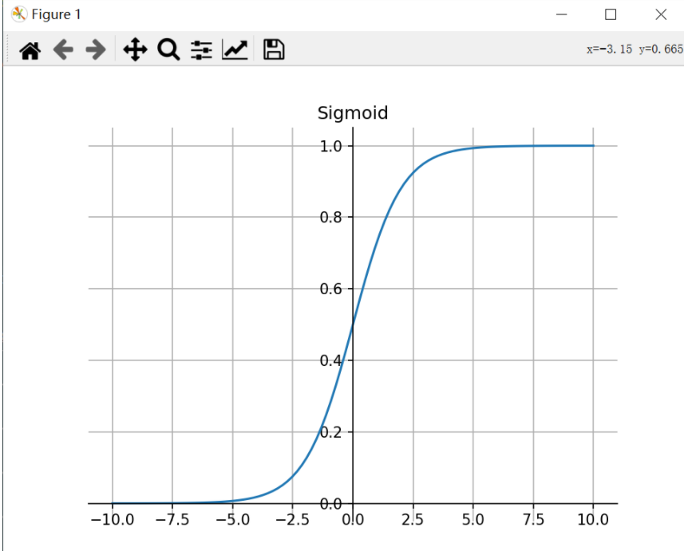

特点：

1. Sigmoid 函数的输出范围是 0 到 1。由于输出值在 0 到 1，所以它可以对每个神经元的输出进行了归一化。
2. 因为Sigmoid 函数的输出范围是 0 到 1，所以可以用于将预测概率作为输出的模型。
3. 梯度平滑，避免**跳跃**的输出值。
4. 容易梯度消失。
5. 函数输出不是以 0 为中心的，这会降低权重更新的效率。
6. Sigmoid 函数是指数运算，计算机运行得较慢。
7. sigmoid函数在输入绝对值很大时会出现饱和现象，导致梯度消失。
8. sigmoid函数的输出不是0均值，会导致后层的神经元输入时非0均值的信号，会对梯度产生影响
9. 计算复杂度高，因为时指数形式。

# 2. Tanh

公式：

$$
f ( x ) = \frac { 2 } { 1 + e ^ { -2x } } - 1
$$

图像：

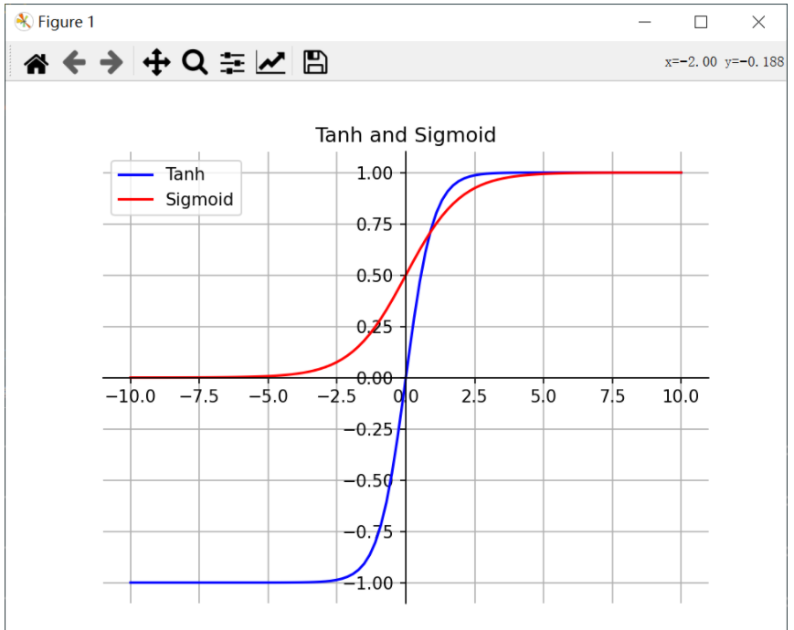

特点：

1. 首先，当输入较大或较小时，输出几乎是平滑的并且梯度较小，这不利于权重更新。二者的区别在于输出间隔，Tanh 的输出间隔为 1，并且整个函数以 0 为中心，比 Sigmoid 函数更好。
2. 在 Tanh 图中，负数信号输入，输出也是负数信号。
3. 在一般的二元分类问题中，Tanh 函数用于隐藏层，而 Sigmoid 函数用于输出层，但这并不是固定的，需要根据特定问题进行调整。
4. Tanh是0均值的，因此实际应用中tanh会比sigmoid更好，收敛更快。但是仍然存在梯度饱和和指数计算的问题。

# 3. ReLU

公式：

$$
f ( x ) = \{ \begin{array} { l l } { m a x ( 0 , x ) } & { x \geq 0 } \\ { 0 } & { x \lt 0 } \end{array}
$$

图像：

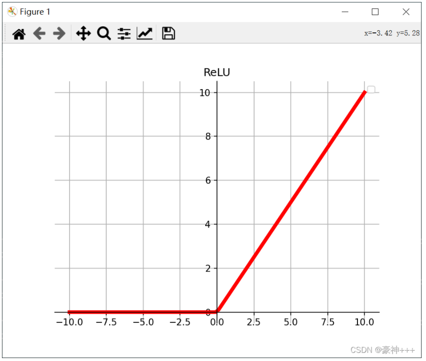

特点：

1. 当输入为正时，不存在梯度饱和问题。

2. 计算速度快。ReLU 函数中只存在线性关系，因此它的计算速度比 sigmoid 和 tanh 更快。

3. 当输入为负时，ReLU 完全失效，在正向传播过程中，这不是问题。有些区域很敏感，有些则不敏感。但是在反向传播过程中，如果输入负数，则梯度将完全为零。

4. 使用Relu的SGD算法的收敛速度比sigmoid和tanh块，在x>0区域上不会出现梯度饱和和梯度消失的问题。计算复杂度低，不需要指数运算。

5. 输出不是0均值。

6. dead relu （神经元坏死现象): relu在负数区域被kill的现象叫做dead relu，当x<0,梯度为0，这个神经元及之后的神经元梯度永远为0，不再对任何数据有所响应，导致相应的参数不会更新
   
   产生这种现象的两个原因：参数初始化问题；learning rate太高导致在训练过程中参数更新太大。
   
   解决方法：采用Xavier初始化方法，以及避免将learning rate设置太大或者使用adagrad等自动调节learning rate

# 4. Softmax

公式：

$$
\frac{e^{x_{i}}}{\sum_{j=1}^{n} e^{x} j}
$$

图像：

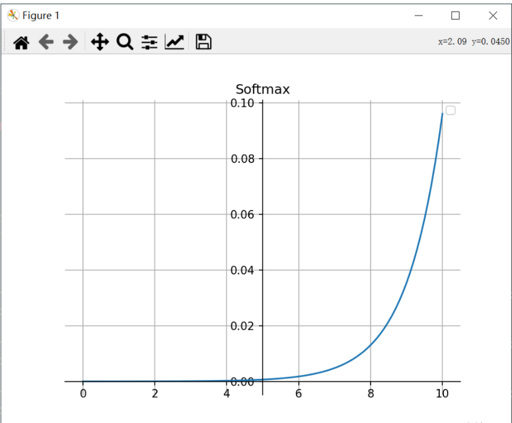

特点：

1. 在零点不可微。
2. 负数信号输入的梯度为零，这意味着对于该区域的激活，权重不会在反向传播期间更新，因此会产生永不激活的死亡神经元。
3. Softmax 函数的分母结合了原始输出值的所有因子，这意味着 Softmax 函数获得的各种概率彼此相关，因此Softmax 是用于多类分类问题。

# 5. Leaky ReLU

公式：

它是一种专门设计用于解决 ReLU 梯度消失问题的激活函数。为了解决dead relu现象，用一个类似0.01的小值来初始化神经元，从而使relu在负数区域更偏向于激活而不是死掉，这里的斜率是确定的。

$$
f ( x ) = \{ \begin{array} { l l } { x } & { x \geq 0 } \\ { a x } & { x \lt 0 } \end{array}
$$

图像：

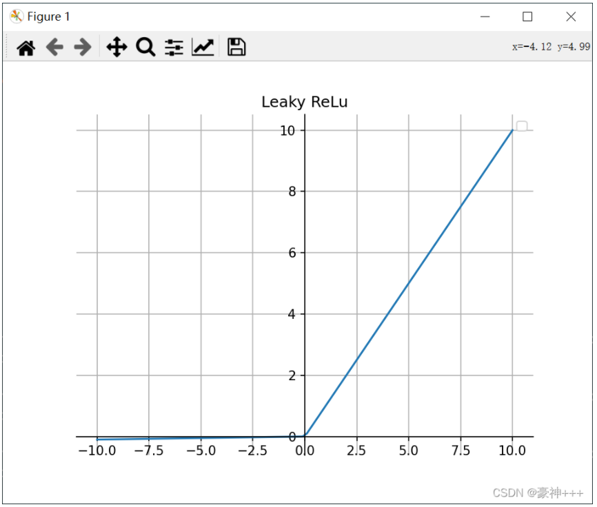

特点：

1. Leaky ReLU 通过把 x 的非常小的线性分量给予负数信号来调整负值的零梯度问题。
2. leak 有助于扩大 ReLU 函数的范围，通常 a 的值为 0.01 左右。
3. 缓解了dead relu问题。
4. 实际中不太稳定，有些近似线性，导致在复杂分类中效果不好。

```注意：从理论上讲，Leaky ReLU 具有 ReLU 的所有优点，而且 Dead ReLU 不会有任何问题，但在实际操作中，尚未完全证明 Leaky ReLU 总是比 ReLU 更好。```

# 6. ELU

公式：

ELU 的提出也解决了 ReLU 的问题。与 ReLU 相比，ELU 有负值，这会使激活的平均值接近零。均值激活接近于零可以使学习更快，因为它们使梯度更接近自然梯度。

$$
f ( x ) = \{ \begin{array} { l l } { x } & { x \geq 0 } \\ { \alpha ( e ^ { x } - 1 ) } & { x \lt 0 } \end{array}
$$

图像：

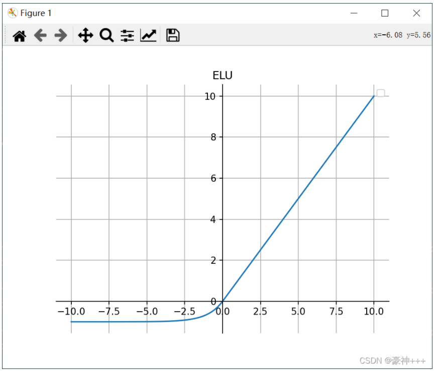

特点：

1. ELU 通过减少偏置偏移的影响，使正常梯度更接近于单位自然梯度，从而使均值向零加速学习。
2. ELU 在较小的输入下会饱和至负值，从而减少前向传播的变异和信息。
3. 指数线性单元，具有Relu的优势，没有dead relu的问题，输出均值接近于0.有负数饱和区，从而对噪声有一些鲁棒性。
4. 计算量稍大，原点不可导

```注意：它的计算强度更高。与 Leaky ReLU 类似，尽管理论上比 ReLU 要好，但目前在实践中没有充分的证据表明 ELU 总是比 ReLU 好。```

# 7. PReLU

公式：

$$
f ( x ) = \{ \begin{array} { l l } { x } & { x \geq 0 } \\ { \alpha x } & { x \lt 0 } \end{array}
$$

$\alpha$是可学习的参数。一般初始化为0.25。（和leaky relu的区别）

图像：

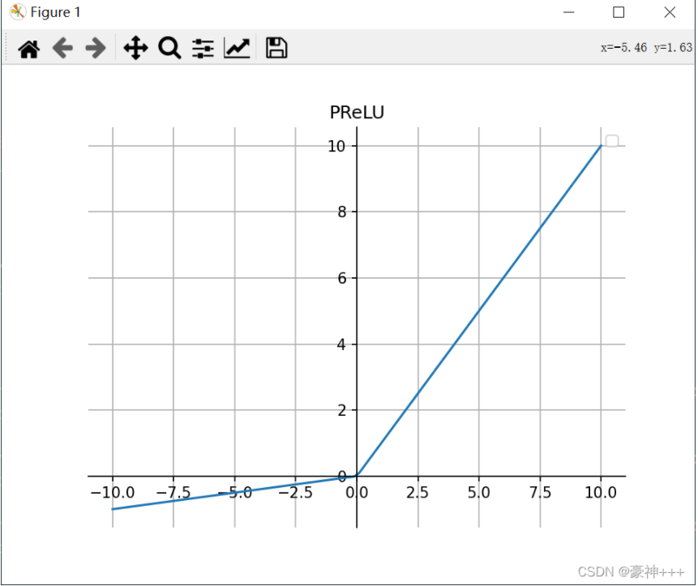

特点：

1. 与 ELU 相比，PReLU 在负值域是线性运算。尽管斜率很小，但不会趋于 0。

# 8. Swish

公式：

$$
\operatorname { swis } h ( x ) = x \cdot \operatorname { sigmoid } ( \beta x )
$$

*β*是超参或者可学习的参数。Swish激活函数具备无上界有下界、平滑、非单调的特性，Swish在深层模型上效果优于ReLU。

图像：

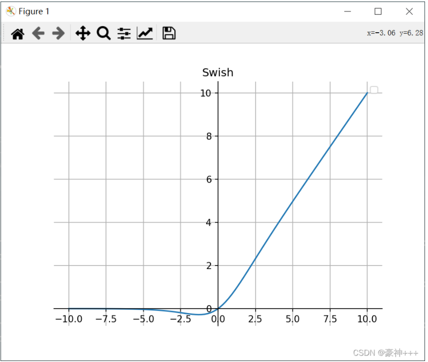

特点：

1. **无界性**有助于防止慢速训练期间，梯度逐渐接近 0 并导致饱和；（同时，有界性也是有优势的，因为有界激活函数可以具有很强的正则化，并且较大的负输入问题也能解决）。
2. 导数恒大于零。
3. 平滑度在优化和泛化中起了重要作用。

# 9. Mish

公式：

$$
Mish = x \cdot \tanh ( \ln ( 1 + e ^ { x } ) )
$$

图像：

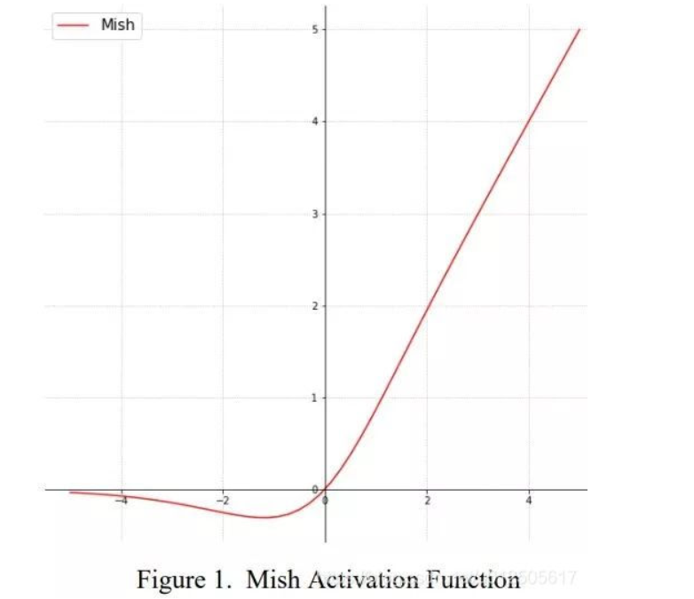

特点：

无

# 10. GELU

公式：

GELU叫高斯误差线性单元，这种激活函数加入了随机正则的思想，是一种对神经元输入的概率描述。公式如下：

$$
G E L U(x)=x P(X<=x)=x \Phi(x)
$$

其中Φ(x)指的是正态分布的概率函数。对于假设为标准正态分布的GELU(x)，论文中提供了近似计算的数学公式，如下：

$$
G E L U ( x ) = 0.5 x ( 1 + \tan h ( \sqrt { \frac { 2 } { \pi } } ( x + 0.044715 x ^ { 3 } ) ) )
$$

或者可以表示为：

$$
\operatorname { swis } h ( x ) = x \cdot \operatorname { sigmoid } ( 1.702 x )
$$

图像：

                                         无

特点：

1. gelu作为激活函数训练时，建议使用一个带动量的优化器。
2. x作为神经元输入，x越大，激活输出x约有可能保留，x越小，越有可能激活结果为0.

# 11. RReLU

公式：

 RReLU是Random ReLU的意思，定义如下:

$$
\operatorname{RReLU}(x)=\left\{\begin{array}{ll}x, & \text { if } x \geq 0 \\ a x, & \text { otherwise }\end{array}\right.
$$

图像：

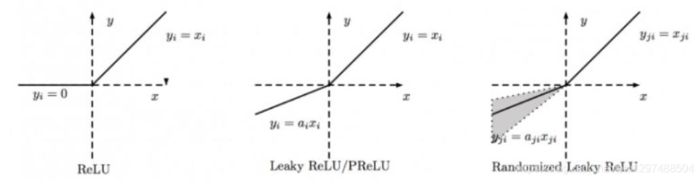

特点：

1. 对RReLU而言, a是一个在给定范围内的随机变量(训练), 在推理时保持不变。同LeakyReLU不同的是，RReLU的a是可以learnable的参数，而LeakyReLU的a是固定的。

# 12. Sofplus

公式：

Softplus作为损失函数在StyleGAN1和2中都得到了使用，公式如下：

$$
Softplus( x ) = \frac { 1 } { \beta } * \log ( 1 + \operatorname { exp } ( \beta * x ) )
$$

图像：

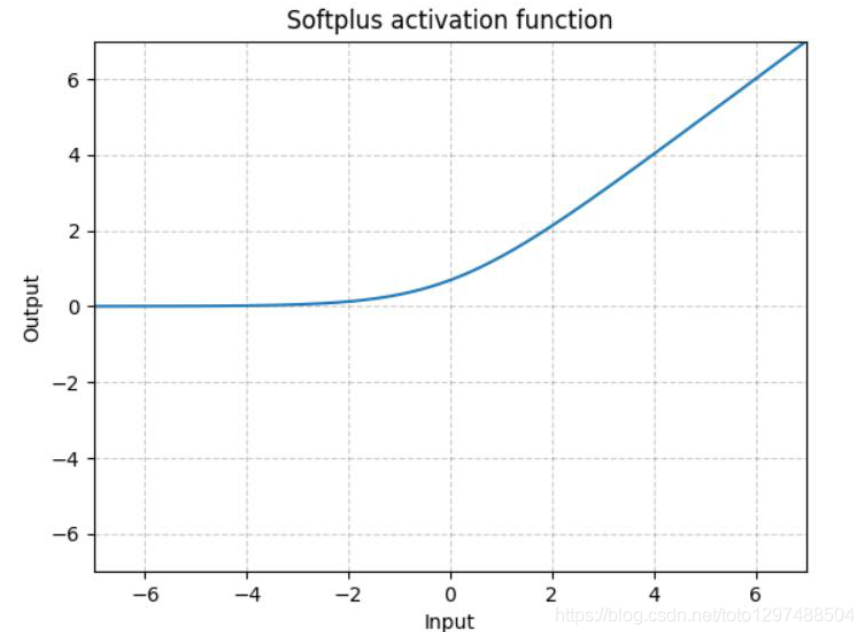

特点：

1. Softplus 是ReLU的光滑近似，可以有效的对输出都为正值的网络进行约束。
   随着β的增加，Softplus与ReLU越来越接近。

# 13. SELU

公式：

跟ELU相比，SELU是将ELU乘上了一个scala变量。

$$
\operatorname{SELU}(x)=\operatorname{scale} *(\max (0, x)+\min (0, \alpha *(\exp (x)-1))
$$

图像：

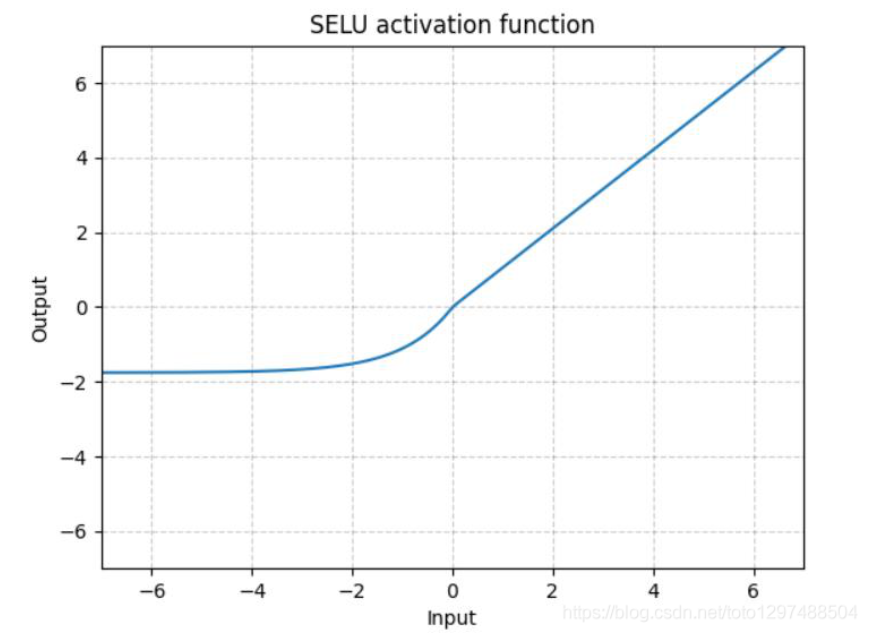

特点：

无

# 14. ReLU6

公式：

$$
\operatorname{ReLU6}(x)=\min (\max (0, x), 6)
$$

图像：

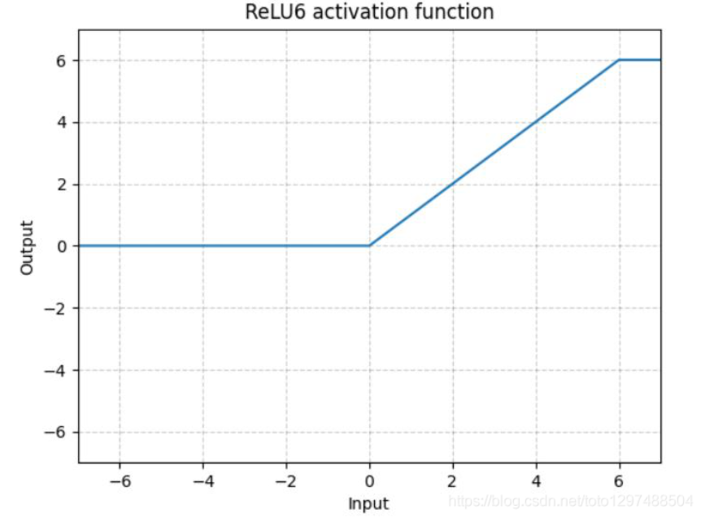

特点：

1. ReLU6是在ReLU的基础上，限制正值的上限6. one-stage的目标检测网络SSD中用这个损失函数。

# 15. maxout

公式：

与常规的激活函数不同，Maxout是一个可以学习的分段线性函数。
其可以看做是在深度学习网络中加入了一层激活函数层，包含一个参数k，这一层相比ReLU，Sigmoid等，其在于增加了k个神经元，然后输出激活值最大的值。
其需要学习的参数就是k个神经元中的权值和偏置，这就相当于常规的激活函数一层，而Maxout是两层，而且参数个数增加了K倍。
其可以有效的原理是，任何ReLU及其变体等激活函数都可以看成分段的线性函数，而Maxout加入的一层神经元正是一个可以学习参数的分段线性函数。

图像：

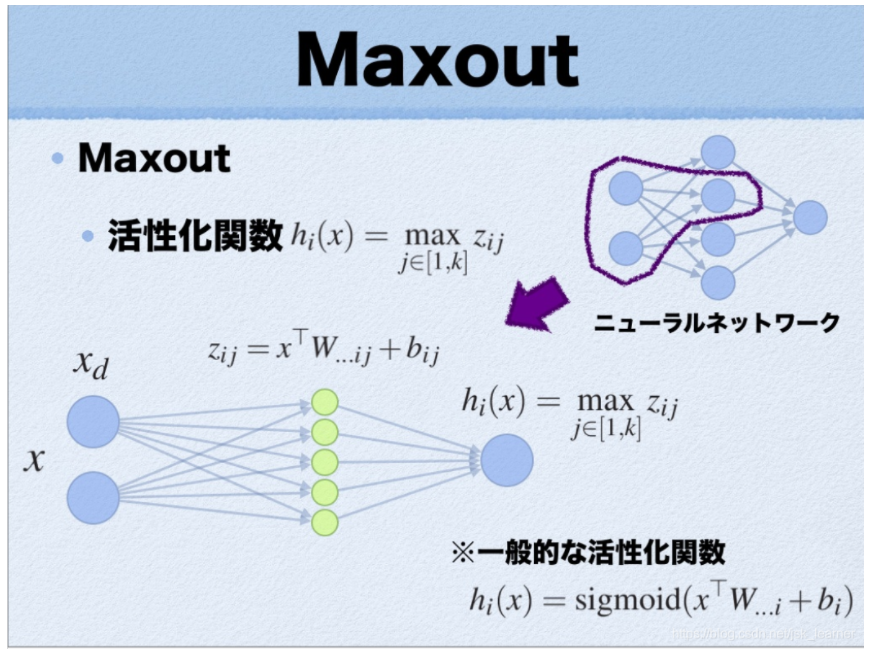

特点：

1. **优点**：其拟合能力很强，理论上可以拟合任意的凸函数；
   具有ReLU的所有优点，线性和非饱和性；
   同时没有ReLU的一些缺点，如神经元的死亡；
2. **缺点**：导致整体参数的激增